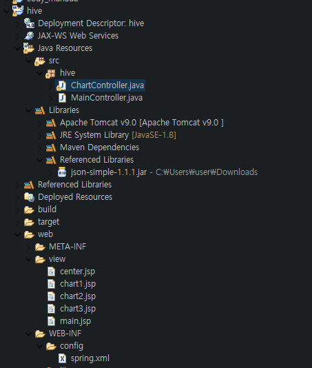
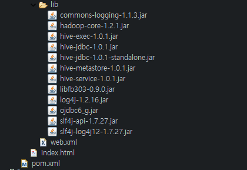

# 20200925


<오프닝>

나영님처럼 깃 포트폴리오 구성하기


## 오전

-----

start-all.sh

hive -- service hiveserver2


이클립스 열기


터미널 하나 더열고

hive

show tables; -> hdi 있는거 확인

select * from hdi limit 10; 을 복사하고 자바에 넣기 (세미콜론 제외)

자바 실행. 콘솔에 결과물이 나오는지 확인


#### 오전 목표: 차트 띄우기

---

- Dynamic Web Project 만들기
  - 이름: hive
  - Content directory: web
  - Generate web.xml deployment descriptor 체크 (그림에는 안 체크 되어있는데 체크 체크)


- 오른쪽 클릭 -> configure -> Mave project -> d04 에서 pom.xml 복사 & web.xml 복사 & spring.xml복사(config폴더도 같이) 

- WEB-INF/lib 안에 hivelibs 파일들 다 넣기 

- web.xml 수정 : 


- spring.xml 수정: 

  - <!-- ViewResolver -->  빼고 다 지우기

  - 14 라인 <context:component-scan base-package="hive" />로 바꾸기


더 쓰려는 찰나 선생님이 샘플자료를 올려주셨네요.

카페에 가서 '유용한 자료'-> 'hive sample' 다운로드해서 import

####  

### 이어서

---

web/view 에 chart1, chart2, chart3 라는 jsp  파일 생성

이제 코드 복붙

- index.html

```html
<script>
location.href="main.mc";
</script>
```

- main.jsp

```jsp
<%@ page language="java" contentType="text/html; charset=UTF-8"
    pageEncoding="UTF-8"%>
<%@ taglib prefix="c" uri="http://java.sun.com/jsp/jstl/core"%> 
    
<!DOCTYPE html>
<html>
<head>
<meta charset="UTF-8">
<title>Insert title here</title>
<script src="https://code.highcharts.com/highcharts.js"></script>
<script src="https://code.highcharts.com/modules/series-label.js"></script>
<script src="https://code.highcharts.com/modules/exporting.js"></script>
<script src="https://code.highcharts.com/modules/export-data.js"></script>
<script src="https://code.highcharts.com/modules/accessibility.js"></script>
<script src="https://ajax.googleapis.com/ajax/libs/jquery/1.11.3/jquery.min.js"></script>
</head>
<body>
	<h1>Main Page</h1>
	<h3><a href="chart1.mc">Chart1</a></h3>
	<h3><a href="chart2.mc">Chart2</a></h3>
	<h3><a href="chart3.mc">Chart3</a></h3>
		<c:choose>
			<c:when test="${centerpage == null }">
		   		<jsp:include page="center.jsp"></jsp:include>
			</c:when>
		<c:otherwise>
		   	<jsp:include page="${centerpage}.jsp"></jsp:include>
		</c:otherwise>
	</c:choose>
	
	
</body>
</html>
```

- center.jsp

```jsp
<%@ page language="java" contentType="text/html; charset=UTF-8"
    pageEncoding="UTF-8"%>
<style>
#center{
	width:800px;
	height:500px;
	border:2px solid red;
}
</style>

<div id="center">

</div>
```

- chart1.jsp

```jsp
<%@ page language="java" contentType="text/html; charset=UTF-8"
    pageEncoding="UTF-8"%>
<style>
#container{
	width:800px;
	height:500px;
	border:2px solid red;
}
</style>
<script>
function display(){
	Highcharts.chart('container', {

	    title: {
	        text: 'Solar Employment Growth by Sector, 2010-2016'
	    },

	    subtitle: {
	        text: 'Source: thesolarfoundation.com'
	    },

	    yAxis: {
	        title: {
	            text: 'Number of Employees'
	        }
	    },

	    xAxis: {
	        accessibility: {
	            rangeDescription: 'Range: 2010 to 2017'
	        }
	    },

	    legend: {
	        layout: 'vertical',
	        align: 'right',
	        verticalAlign: 'middle'
	    },

	    plotOptions: {
	        series: {
	            label: {
	                connectorAllowed: false
	            },
	            pointStart: 2010
	        }
	    },

	    series: [{
	        name: 'Installation',
	        data: [43934, 52503, 57177, 69658, 97031, 119931, 137133, 154175]
	    }, {
	        name: 'Manufacturing',
	        data: [24916, 24064, 29742, 29851, 32490, 30282, 38121, 40434]
	    }, {
	        name: 'Sales & Distribution',
	        data: [11744, 17722, 16005, 19771, 20185, 24377, 32147, 39387]
	    }, {
	        name: 'Project Development',
	        data: [null, null, 7988, 12169, 15112, 22452, 34400, 34227]
	    }, {
	        name: 'Other',
	        data: [12908, 5948, 8105, 11248, 8989, 11816, 18274, 18111]
	    }],

	    responsive: {
	        rules: [{
	            condition: {
	                maxWidth: 500
	            },
	            chartOptions: {
	                legend: {
	                    layout: 'horizontal',
	                    align: 'center',
	                    verticalAlign: 'bottom'
	                }
	            }
	        }]
	    }

	});
};
function getData(){
	display();
};


$(document).ready(function(){
	getData();
});
</script>
<h1>Chart1</h1>
<div id="container">

</div>
```

- chart2, chart3 는 아직. chart1 을 하고 있는 중입니다.

- Java Resources/src/hive/MainController.java

```java
package hive;

import org.springframework.stereotype.Controller;
import org.springframework.web.bind.annotation.RequestMapping;
import org.springframework.web.servlet.ModelAndView;

@Controller
public class MainController {

	@RequestMapping("/main.mc")
	public ModelAndView main() {
		ModelAndView mv = new ModelAndView();
		mv.setViewName("main");
		return mv;
	}
	@RequestMapping("/chart1.mc")
	public ModelAndView chart1() {
		ModelAndView mv = new ModelAndView();
		// GET HIVE DATA
		
		// Convert JSON
		mv.addObject("centerpage","chart1");
		mv.setViewName("main");
		return mv;
	}
	@RequestMapping("/chart2.mc")
	public ModelAndView chart2() {
		ModelAndView mv = new ModelAndView();
		mv.addObject("centerpage","chart2");
		mv.setViewName("main");
		return mv;
	}
	@RequestMapping("/chart3.mc")
	public ModelAndView chart3() {
		ModelAndView mv = new ModelAndView();
		mv.addObject("centerpage","chart3");
		mv.setViewName("main");
		return mv;
	}
}

```


- 여기까지 되었다면 


- Chart1 을 누르면 차트가 떠야합니다.


-------------------------------------------------------------------------------------------------------------


- d01 로 가셔서
  - HiveTest.java 수정 (/root에 hdi.txt 있어야 합니다!)

```java
package d01;

import java.sql.Connection;
import java.sql.DriverManager;
import java.sql.PreparedStatement;
import java.sql.ResultSet;

public class HiveTest {

	public static void main(String[] args) throws Exception{
		String url = "jdbc:hive2://192.168.111.120:10000/default";
		String id = "root";								// 이 부분 선생님은 userid 입니다. 
		String password ="111111";
		Class.forName("org.apache.hive.jdbc.HiveDriver");
		Connection con = DriverManager.getConnection(url, id, password);	// 이 부분 선생님은 (url, userid, password) 입니다. 
		PreparedStatement pstmt = con.prepareStatement("SELECT * FROM hdi limit 10");
		ResultSet rset = pstmt.executeQuery();
		while(rset.next()) {
			String s1 = rset.getString(2);
			float s2 = rset.getFloat(3);
			float s3 = rset.getFloat(4);
			float s4 = rset.getFloat(5);
			System.out.println(s1+" "+s2+" "+s3+" "+s4);
		}
		con.close();
	}

}

```


- 카페/선생님 게시판 에서 JSON Lib 다운받으시고 압축풀기

- d01 properites-> java build path -> Libraries 에 압축푸신거 넣으시면 됩니다.

---


#### 오후 과제는 d01에서 하이브 테이블을 차트에 넣어서 웹에다 띄우는 것입니다. 같이 하기 전에 오전에 한번 시도해보라고 하셨습니다. 

#### 끝


##오후: 데이터를 hive에 저장하고 웹에 테이블 띄우기

### 1. 하이브 설정


```
// 터미널1: 하이브 연결
hive --service hiveserver2

// 터미널2: 데이터를 받아 /root에 꺼내놓기
cd 다운로드
mv로 간단하게 이름 바꾸고
mv 파일명 /root

// 터미널3: 하이브 테이블 작업
hive
# hive 예제로 있던 hdi 테이블
CREATE TABLE HDI(id INT, country STRING, hdi FLOAT, lifeex INT, mysch INT, eysch INT, gni INT) ROW FORMAT DELIMITED FIELDS TERMINATED BY ',' STORED AS TEXTFILE;
load data local inpath '/root/hdi.txt' OVERWRITE into table HDI;

# 난이도 하
create table independence(Year INT, region STRING, indep INT) ROW FORMAT DELIMITED FIELDS TERMINATED BY '\t' LINES TERMINATED BY '\n' STORED AS TEXTFILE;
LOAD DATA LOCAL INPATH '/root/report.txt' OVERWRITE INTO TABLE independence;

# 난이도 상
CREATE TABLE trail(Month INT, Line STRING, Station STRING,4to5 INT,5to6 INt,6to7 INT,7to8 INT,8to9 INT,9to10 INT,10to11 INT,11to12 INT,12to13 INT,13to14 INT,14to15 INT,15to16 INT,16to17 INT,17to18 INT, 18to19 INT,19to20 INT,20to21 INT,21to22 INT,22to23 INT,23to24 INT,0to1 INT,1to2 INT,2to3 INT,3to4 INT,date INT) ROW FORMAT DELIMITED FIELDS TERMINATED BY ',' LINES TERMINATED BY '\n' STORED AS TEXTFILE;
LOAD DATA LOCAL INPATH '/root/trail.csv' OVERWRITE INTO TABLE trail;
```


※ 데이터에서 한글 깨짐 현상 해결 방법

윈도우 메모장에서 복사하여 붙여넣는다.


### 2. 자바 설정

* index.html

```html
<script>
location.href="main.mc";
</script>
```

* main.jsp

```jsp
<%@ page language="java" contentType="text/html; charset=UTF-8"
    pageEncoding="UTF-8"%>
<%@ taglib prefix="c" uri="http://java.sun.com/jsp/jstl/core"%> 
    
<!DOCTYPE html>
<html>
<head>
<meta charset="UTF-8">
<title>Insert title here</title>
<script src="https://code.highcharts.com/highcharts.js"></script>
<script src="https://code.highcharts.com/modules/series-label.js"></script>
<script src="https://code.highcharts.com/modules/exporting.js"></script>
<script src="https://code.highcharts.com/modules/export-data.js"></script>
<script src="https://code.highcharts.com/modules/accessibility.js"></script>
<script src="https://ajax.googleapis.com/ajax/libs/jquery/1.11.3/jquery.min.js"></script>
<script src="https://code.highcharts.com/modules/streamgraph.js"></script>
<script src="https://code.highcharts.com/modules/annotations.js"></script>
</head>
<body>
	<h1>Main Page</h1>
	<h3><a href="chart1.mc">Chart1</a></h3>
	<h3><a href="chart2.mc">Chart2</a></h3>
	<h3><a href="chart3.mc">Chart3</a></h3>
		<c:choose>
			<c:when test="${centerpage == null }">
		   		<jsp:include page="center.jsp"></jsp:include>
			</c:when>
		<c:otherwise>
		   	<jsp:include page="${centerpage}.jsp"></jsp:include>
		</c:otherwise>
	</c:choose>
</body>
</html>
```

* center.jsp

```jsp
<%@ page language="java" contentType="text/html; charset=UTF-8"
    pageEncoding="UTF-8"%>
<style>
#center{
	width:800px;
	height:500px;
	border:2px solid red;
}
</style>
<div id="center">

</div>
```

* chart1.jsp

```jsp
<%@ page language="java" contentType="text/html; charset=UTF-8"
    pageEncoding="UTF-8"%>
<style>
#container{
	width:800px;
	height:500px;
	border:2px solid red;
}
</style>
<script>
function display(data){
	Highcharts.chart('container', {
	    title: {
	        text: 'Solar Employment Growth by Sector, 2010-2016'
	    },
	    subtitle: {
	        text: 'Source: thesolarfoundation.com'
	    },
	    yAxis: {
	        title: {
	            text: 'Number of Employees'
	        }
	    },
	    xAxis: {
	        accessibility: {
	            rangeDescription: 'Range: 2010 to 2017'
	        }
	    },
	    legend: {
	        layout: 'vertical',
	        align: 'right',
	        verticalAlign: 'middle'
	    },
	    plotOptions: {
	        series: {
	            label: {
	                connectorAllowed: false
	            },
	            pointStart: 2010
	        }
	    },
	    series: data,
	    responsive: {
	        rules: [{
	            condition: {
	                maxWidth: 500
	            },
	            chartOptions: {
	                legend: {
	                    layout: 'horizontal',
	                    align: 'center',
	                    verticalAlign: 'bottom'
	                }
	            }
	        }]
	    }
	});
};
    
function getData(){
	$.ajax({
		url:'getdata1.mc',
		success:function(data){
			alert(data);	
			display(data);
		},
		error:function(){
			alert('fail');
		}
	});
	//display();
};

$(document).ready(function(){
	getData();
});
</script>
<h1>Chart1</h1>
<div id="container">

</div>
```

* chart2.jsp

```jsp
<%@ page language="java" contentType="text/html; charset=UTF-8"
    pageEncoding="UTF-8"%>
<style>
#center{
	width:800px;
	height:500px;
	border:2px solid red;
}
</style>
<script>
	$(document).ready(function(){
		getData();
	});
	
	function getData(){
		$.ajax({
			url: 'getdata2.mc',
			success: function(data){
				alert(data);
				display(data);
			}
		})
	};
	function display(data){
		Highcharts.chart('container', {
		    chart: {
		        type: 'column'
		    },
		    title: {
		        text: '서울시 재정자립도 통계 2020'
		    },
		    subtitle: {
		        text: 'Source: <a href="http://en.wikipedia.org/wiki/List_of_cities_proper_by_population">Wikipedia</a>'
		    },
		    xAxis: {
		        type: 'category',
		        labels: {
		            rotation: -45,
		            style: {
		                fontSize: '13px',
		                fontFamily: 'Verdana, sans-serif'
		            }
		        }
		    },
		    yAxis: {
		        min: 0,
		        title: {
		            text: 'Population (millions)'
		        }
		    },
		    legend: {
		        enabled: false
		    },
		    tooltip: {
		        pointFormat: 'Population in 2017: <b>{point.y:.1f} millions</b>'
		    },
		    series: data
		});
	}
</script>
<h1>Chart2</h1>
<div id="container">

</div>
```

* chart3.jsp

```jsp
<%@ page language="java" contentType="text/html; charset=UTF-8"
    pageEncoding="UTF-8"%>
<style>
#center{
	width:800px;
	height:500px;
	border:2px solid red;
}
</style>
<script>
	$(document).ready(function(){
		getData();
	});
	function getData(){
		$.ajax({
			url:'getdata3.mc',
			success: function(data){
				alert(data);
				display(data);
			}
		})
	};
	function display(data){
		var colors = Highcharts.getOptions().colors;
		Highcharts.chart('container', {

		    chart: {
		        type: 'streamgraph',
		        marginBottom: 30,
		        zoomType: 'x'
		    },

		    // Make sure connected countries have similar colors
		    colors: [
		        colors[0],
		        colors[1],
		        colors[2],
		        colors[3],
		        colors[4],
		        // East Germany, West Germany and Germany
		        Highcharts.color(colors[5]).brighten(0.2).get(),
		        Highcharts.color(colors[5]).brighten(0.1).get(),

		        colors[5],
		        colors[6],
		        colors[7],
		        colors[8],
		        colors[9],
		        colors[0],
		        colors[1],
		        colors[3],
		        // Soviet Union, Russia
		        Highcharts.color(colors[2]).brighten(-0.1).get(),
		        Highcharts.color(colors[2]).brighten(-0.2).get(),
		        Highcharts.color(colors[2]).brighten(-0.3).get()
		    ],

		    title: {
		        floating: true,
		        align: 'left',
		        text: 'Winter Olympic Medal Wins'
		    },
		    subtitle: {
		        floating: true,
		        align: 'left',
		        y: 30,
		        text: 'Source: <a href="https://www.sports-reference.com/olympics/winter/1924/">sports-reference.com</a>'
		    },

		    xAxis: {
		        maxPadding: 0,
		        type: 'category',
		        crosshair: true,
		        categories: [
		            '4시~5시',
		            '5시~6시',
		            '6시~7시',
		            '7시~8시',
		            '8시~9시',
		            '9시~10시',
		            '10시~11시',
		            '11시~12시',
		            '12시~13시',
		            '13시~14시',
		            '14시~15시',
		            '15시~16시',
		            '16시~17시',
		            '17시~18시',
		            '18시~19시',
		            '19시~20시',
		            '20시~21시',
		            '21시~22시',
		            '22시~23시',
		            '23시~24시',
		            '0시~1시',
		            '1시~2시',
		            '2시~3시',
		            '3시~4시',
		        ],
		        labels: {
		            align: 'left',
		            reserveSpace: false,
		            rotation: 270
		        },
		        lineWidth: 0,
		        margin: 20,
		        tickWidth: 0
		    },

		    yAxis: {
		        visible: false,
		        startOnTick: false,
		        endOnTick: false
		    },

		    legend: {
		        enabled: false
		    },

		    annotations: [{
		        labels: [{
		            point: {
		                x: 5.5,
		                xAxis: 0,
		                y: 30,
		                yAxis: 0
		            },
		            text: 'Cancelled<br>during<br>World War II'
		        }, {
		            point: {
		                x: 18,
		                xAxis: 0,
		                y: 90,
		                yAxis: 0
		            },
		            text: 'Soviet Union fell,<br>Germany united'
		        }],
		        labelOptions: {
		            backgroundColor: 'rgba(255,255,255,0.5)',
		            borderColor: 'silver'
		        }
		    }],

		    plotOptions: {
		        series: {
		            label: {
		                minFontSize: 5,
		                maxFontSize: 15,
		                style: {
		                    color: 'rgba(255,255,255,0.75)'
		                }
		            }
		        }
		    },

		    // Data parsed with olympic-medals.node.js
		    series: data,
		    exporting: {
		        sourceWidth: 800,
		        sourceHeight: 600
		    }
		});
	};
</script>
<h1>Chart3</h1>
<div id="container">

</div>
```

* MainController.java

```java
package hive;

import org.springframework.stereotype.Controller;
import org.springframework.web.bind.annotation.RequestMapping;
import org.springframework.web.servlet.ModelAndView;

@Controller
public class MainController {
	
	@RequestMapping("/main.mc")
	public ModelAndView main() {
		ModelAndView mv = new ModelAndView();
		mv.setViewName("main");
		return mv;
	}
	@RequestMapping("/chart1.mc")
	public ModelAndView chart1() {
		ModelAndView mv = new ModelAndView();
		// GET HIVE DATA
		
		// Convert JSON
		mv.addObject("centerpage","chart1");
		mv.setViewName("main");
		return mv;
	}
	@RequestMapping("/chart2.mc")
	public ModelAndView chart2() {
		ModelAndView mv = new ModelAndView();
		mv.addObject("centerpage","chart2");
		mv.setViewName("main");
		return mv;
	}
	@RequestMapping("/chart3.mc")
	public ModelAndView chart3() {
		ModelAndView mv = new ModelAndView();
		mv.addObject("centerpage","chart3");
		mv.setViewName("main");
		return mv;
	}
}

```

* ChartController.java

```java
package hive;

import java.io.PrintWriter;
import java.sql.Connection;
import java.sql.DriverManager;
import java.sql.PreparedStatement;
import java.sql.ResultSet;

import javax.servlet.http.HttpServletResponse;

import org.json.simple.JSONArray;
import org.json.simple.JSONObject;
import org.springframework.stereotype.Controller;
import org.springframework.web.bind.annotation.RequestMapping;
import org.springframework.web.bind.annotation.ResponseBody;

@Controller
public class ChartController {
	String url = "jdbc:hive2://192.168.111.120:10000/default";
	String id = "root";
	String password ="111111";
	
	public ChartController() {
		try {
			Class.forName("org.apache.hive.jdbc.HiveDriver");
		} catch (ClassNotFoundException e) {
			e.printStackTrace();
		}
	}
	@RequestMapping("/getdata1.mc")
	@ResponseBody
	public void getdata1(HttpServletResponse res) throws Exception{
			
		Connection con = null;
		JSONArray ja = new JSONArray();
			
		try {
			con = DriverManager.getConnection(url, id, password);
			PreparedStatement pstmt = con.prepareStatement("SELECT * FROM hdi limit 10");
			ResultSet rset = pstmt.executeQuery();
			// [{name: 'Sweden',data:[0.904 81.0 11.0]},{}]
			while(rset.next()) {
				JSONObject jo =new JSONObject();
				jo.put("name", rset.getString(2));
				JSONArray jo2 = new JSONArray();
				jo2.add(rset.getFloat(3));
				jo2.add(rset.getFloat(4));
				jo2.add(rset.getFloat(5));
				jo.put("data", jo2);
				
				ja.add(jo);
			}
		}catch(Exception e) {
			throw e;
		}finally {
			con.close();
		}
		
	        res.setCharacterEncoding("EUC-KR");
	        res.setContentType("application/json");
	        PrintWriter out = res.getWriter();
	        out.print(ja.toJSONString());
	        out.close();
	}
	@RequestMapping("/getdata2.mc")
	@ResponseBody
	public void getdata2(HttpServletResponse res) throws Exception{
		
		Connection con = null;
		JSONArray ja = new JSONArray();
		JSONObject jo = new JSONObject();
		jo.put("name", "Population");
		JSONArray ja2 = new JSONArray();
		
		try {
			con = DriverManager.getConnection(url, id, password);
			PreparedStatement pstmt = con.prepareStatement("SELECT * FROM independence limit 10");
			ResultSet rset = pstmt.executeQuery();
			// [{name:"Population",data: [[],[],[]]}]
				while(rset.next()) {
				JSONArray ja3 = new JSONArray();
				ja3.add(rset.getString(2));
				ja3.add(rset.getFloat(3));
				ja2.add(ja3);
			}
			jo.put("data",ja2);	
			ja.add(jo);
		}catch(Exception e) {
			throw e;
		}finally {
			con.close();
		}
		
		res.setCharacterEncoding("EUC-KR");
		res.setContentType("application/json");
		PrintWriter out = res.getWriter();
		out.print(ja.toJSONString());
		out.close();
	}
	@RequestMapping("/getdata3.mc")
	@ResponseBody
	public void getdata3(HttpServletResponse res) throws Exception{
		
		Connection con = null;
		JSONArray ja = new JSONArray();
		
		try {
			con = DriverManager.getConnection(url, id, password);
			PreparedStatement pstmt = con.prepareStatement("SELECT * FROM trail limit 30");
			ResultSet rset = pstmt.executeQuery();
			//  [{name: "Finland", data: []},{name ...}]
			while(rset.next()) {
				JSONObject jo = new JSONObject();
				jo.put("name", rset.getString(3));
				JSONArray ja2 = new JSONArray();
				for(int i=4;i<27;i++) {
					ja2.add(rset.getFloat(i));
				}
				jo.put("data",ja2);	
				ja.add(jo);
			}
		}catch(Exception e) {
			throw e;
		}finally {
			con.close();
		}
		
		res.setCharacterEncoding("EUC-KR");
		res.setContentType("application/json");
		PrintWriter out = res.getWriter();
		out.print(ja.toJSONString());
		out.close();
	}
}	
```


* Project Explorer



