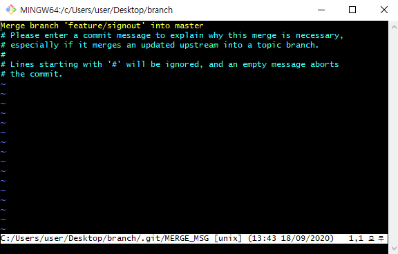

### 상황 1. fast-foward

> fast-foward는 feature 브랜치 생성된 이후 master 브랜치에 변경 사항이 없는 상황

1. feature/test branch 생성 및 이동

    ```bash
   $ git checkout -b feature/test
    ```

   

2. 작업 완료 후 commit

   ```bash
  $ touch test.html
  $ git add.
  $ git commit -m 'Complete test'
  [feature/test 5fd546a] Complete test
   1 file changed, 0 insertions(+), 0 deletions(-)
   create mode 100644 test.html
  
   ```
  
  


3. master 이동

   ```bash
  $ git checkout master
  Switched to branch 'master'
   ```
  
  


4. master에 병합

  ``` bash
  $ git merge feature/test
  Updating aba06c6..5fd546a
  Fast-forward
   test.html | 0
   1 file changed, 0 insertions(+), 0 deletions(-)
   create mode 100644 test.html
  ```
  
  
  
  
  
   


5. 결과 -> fast-foward (단순히 HEAD를 이동)

    ```bash
   $ git log --oneline
   5fd546a (HEAD -> master, feature/test) Complete test
   aba06c6 Complete Test2
   5ff5ca0 (test) Init
    ```

   

6. branch 삭제

  ```bash
  $ git branch -d feature/test
  Deleted branch feature/test (was 5fd546a).
  ```
  
  
  
   

---

### 상황 2. merge commit

> 서로 다른 이력(commit)을 병합(merge)하는 과정에서 다른 파일이 수정되어 있는 상황
>
> git이 auto merging을 진행하고, commit이 발생된다.

1. feature/signout branch 생성 및 이동

    ```bash
   $ git checkout -b feature/signout
   Switched to a new branch 'feature/signout'
    ```

   

2. 작업 완료 후 commit

    ```bash
   $ touch signout.html
   $ git add .
   $ git commit -m 'Complete signout'
   $ git log --oneline
   ae46f5b (HEAD -> feature/signout) Complete signout
   5fd546a (master) Complete test
   aba06c6 Complete Test2
   5ff5ca0 (test) Init
    ```

   

3. master 이동

    ```bash
   $ git checkout master
   $ git log --oneline
   5fd546a (HEAD -> master) Complete test
   aba06c6 Complete Test2
   5ff5ca0 (test) Init
    ```

   

4. *master에 추가 commit 이 발생시키기!!*

   * **다른 파일을 수정 혹은 생성하세요!**

   ```bash
   $ touch hotfix.html
   $ git add .
   $ git commit -m 'Hotfix'
   $ git log --oneline
   ```

   

5. master에 병합

    ```bash
   $ git merge feature/signout
    ```

   

6. 결과 -> 자동으로 *merge commit 발생*

   

   * vim 편집기 화면이 나타납니다.

   * 자동으로 작성된 커밋 메시지를 확인하고, `esc`를 누른 후 `:wq`를 입력하여 저장 및 종료를 합니다.
      * `w` : write
      * `q` : quit
      
   * 커밋이  확인 해봅시다.

7. 그래프 확인하기

    ```bash
   $ git log --oneline --graph
   *   9840ec8 (HEAD -> master) Merge branch 'feature/signout' into master
   |\
   | * ae46f5b (feature/signout) Complete signout
   * | e8da7fe Hotfix
   |/
   * 5fd546a Complete test
   * aba06c6 Complete Test2
   * 5ff5ca0 (test) Init
   
    ```

   

8. branch 삭제

    ```bash
   $ git branch -d feature/test
   Deleted branch feature/signout (was ae46f5b).
    ```

   

---

### 상황 3. merge commit 충돌

> 서로 다른 이력(commit)을 병합(merge)하는 과정에서 동일 파일이 수정되어 있는 상황
>
> git이 auto merging을 하지 못하고, 해당 파일의 위치에 라벨링을 해준다.
>
> 원하는 형태의 코드로 직접 수정을 하고 merge commit을 발생 시켜야 한다.

1. feature/board branch 생성 및 이동

   ```bash
   $ git checkout -b feature/board
   ```

   

   

2. 작업 완료 후 commit

   ```bash
  $ touch board.html
  # README.md 파일을 열어서 자유롭게 수정
  $ git add .
  $ git commit -m 'board & README'
  $ git log --oneline
  64a1c62 (HEAD -> feature/board) board & README
  9840ec8 (master) Merge branch 'feature/signout' into master
  e8da7fe Hotfix
  ae46f5b Complete signout
  5fd546a Complete test
  aba06c6 Complete Test2
  5ff5ca0 (test) Init
  
   ```
  
  


3. master 이동

   ```bash
  $ git checkout master
   ```
  
  


4. *master에 추가 commit 이 발생시키기!!*

   * **동일 파일을 수정 혹은 생성하세요!**

   ```bash
   
   ```

   

5. master에 병합

   ```bash
  $ git merge feature/board
  # 자동 병합을 하고 있는데 ...
  Auto-merging README.md
  # 충돌!
  
   ```
  
  


6. 결과 -> *merge conflict발생*

   ```bash
  $ git status
  
   ```
  
  


7. 충돌 확인 및 해결

   


8. merge commit 진행

    ```bash
    $ git commit
    ```

   * vim 편집기 화면이 나타납니다.
   
   * 자동으로 작성된 커밋 메시지를 확인하고, `esc`를 누른 후 `:wq`를 입력하여 저장 및 종료를 합니다.
      * `w` : write
      * `q` : quit
      
   * 커밋이  확인 해봅시다.
   
9. 그래프 확인하기

    


10. branch 삭제

    
